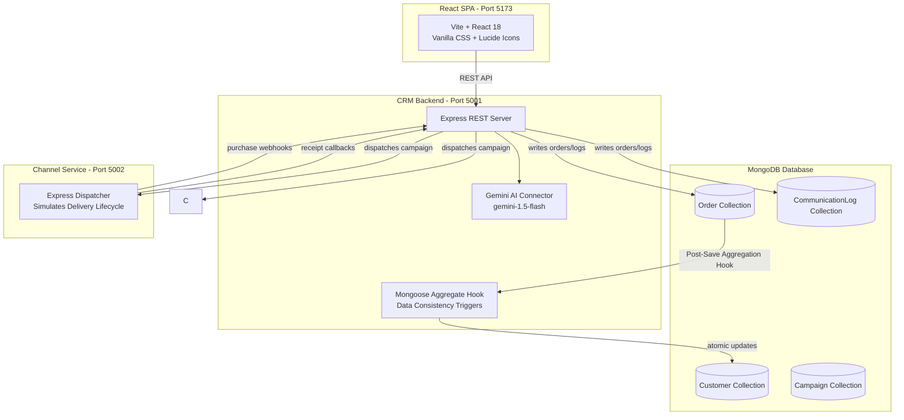
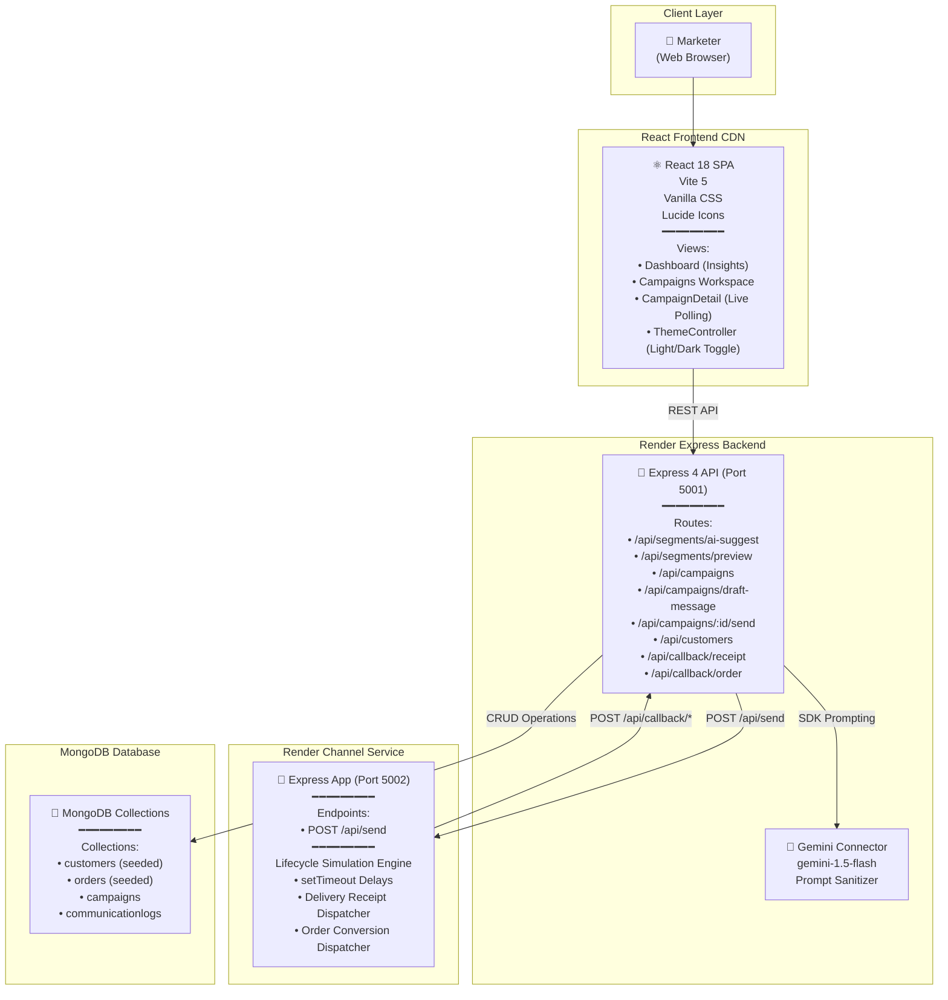
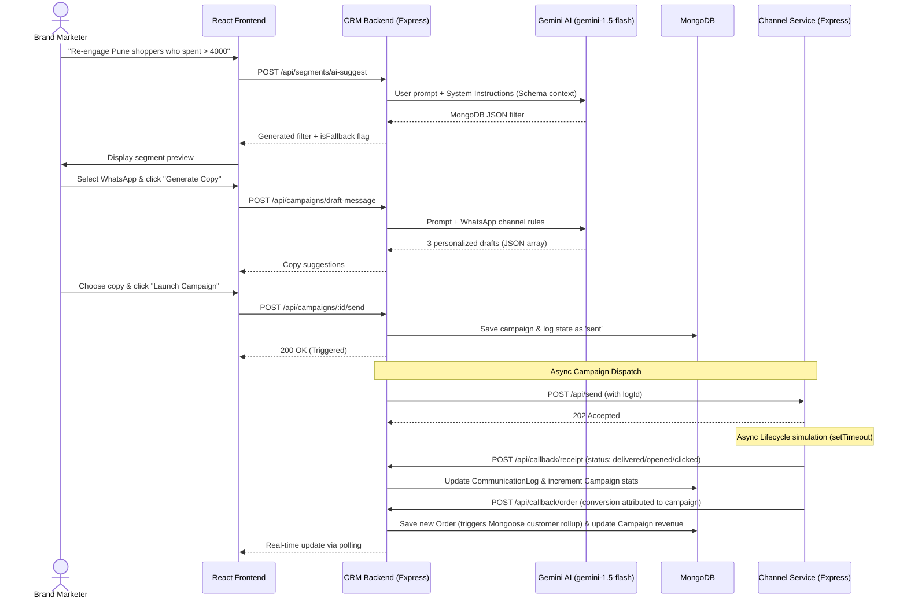
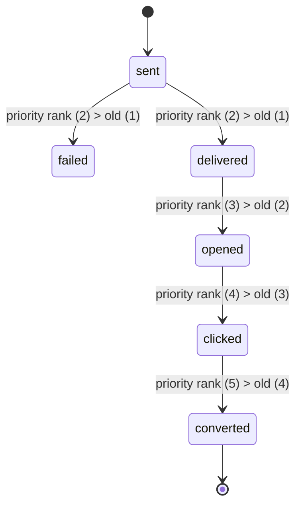

# Xeno Mini CRM — Campaign Agent

An AI-native mini CRM that lets marketers run data-driven campaigns through natural language conversation. A marketer describes what they want to achieve; the AI agent figures out who to target, what to say, how to deliver it, and tracks every outcome.


---


## Table of Contents

- [What We Built](#what-we-built)
- [Why This Approach](#why-this-approach)
- [Architecture](#architecture)
- [System Architecture (Detailed)](#system-architecture-detailed)
  - [High-Level Component Diagram](#high-level-component-diagram)
  - [Data Flow Sequence: Campaign Launch](#data-flow-sequence-campaign-launch)
  - [Webhook Callback State Machine](#webhook-callback-state-machine)
- [Design Patterns Used](#design-patterns-used)
- [Pattern-to-File Index (Quick Reference)](#pattern-to-file-index-quick-reference)
- [Tech Stack](#tech-stack)
- [Data Model](#data-model)
- [AI Segmenter & Copywriter Design](#ai-segmenter--copywriter-design)
- [Simulated Channel Service](#simulated-channel-service)
- [Seed Data](#seed-data)
- [Local Development](#local-development)
- [Demo Queries](#demo-queries)
- [Known Limitations & Tradeoffs](#known-limitations--tradeoffs)

---

## What We Built

**Xeno Campaign** is a full-stack AI-native CRM built for customer segmentation, campaign generation, and live delivery tracking. It enables a brand marketer to run personalized multi-channel campaigns—WhatsApp, SMS, Email, and RCS—entirely supported by conversational AI.

### Core Capabilities

| Capability | What It Does |
|---|---|
| **Conversational Audience Segmentation** | Marketer describes intent in plain English; Gemini translates it directly to MongoDB query filters |
| **Real-time Segment Preview** | Resolves matches instantly to display matching customer counts and profiles |
| **AI-Generated Copywriting** | Gemini generates 3 personalized message copy options tailored to the audience and channel rules |
| **Multi-Channel Delivery Simulation** | Decoupled Channel Service handles asynchronous message dispatches with randomized latency |
| **Priority Webhook Reception** | Delivery updates are returned via webhooks, passing through a status ranking check to prevent race conditions |
| **Aggregated Data Consistency** | Orders automatically roll up calculations (total spend, counts, last purchase date) to the Customer profile |
| **Vanilla CSS Fluid Visuals** | Gorgeous dark/light theme switching with glassmorphism overlays and responsive charts |

---

## Why This Approach

The assignment requires an "AI-native" product — where AI is woven into the product's core operations.

### Design Decision: Conversational AI-native Flows

Instead of forcing marketers to fill out complex forms, configure nested filters, or write copy manually, we built:
1. **Conversational Database Querying**: The AI reads the database schema and writes complex MongoDB filters based on prompt parameters (cities, spending values, time-based inactive cohorts).
2. **Fallback Parsing Strategy**: If the Gemini API key is missing or fails, the CRM falls back to a rule-based RegExp parser so core functionality never breaks.
3. **Decoupled Asynchronous Processing**: Dispatch routines run outside the main request loop, preventing HTTP request timeouts for campaigns targeting large lists.
4. **Data Aggregation Triggers**: Rather than joining orders and customer tables in real-time, data aggregation happens at the write level, keeping read operations fast and cheap.

---

## Architecture



---

## System Architecture (Detailed)

### High-Level Component Diagram



### Data Flow Sequence: Campaign Launch



### Webhook Callback State Machine

Due to async delivery queues, delivery callbacks can occasionally arrive out-of-order. The webhook receiver protects the data integrity of campaigns using a status priority ranking filter:



---

## Design Patterns Used

| Pattern | Where | Why |
|---|---|---|
| **Data Consistency Rollup (Mongoose Hooks)** | `backend/src/models/Order.js` | Automatically updates customer aggregate metrics (`totalSpend`, `orderCount`, `lastPurchaseDate`) on order write. |
| **Status Priority State Machine** | `backend/src/routes/callback.js` | Assigns hierarchy levels to webhook callback events (`sent` < `delivered` < `opened` < `clicked` < `converted`), preventing out-of-order log updates. |
| **AI System Prompts with JSON Enforcement** | `backend/src/routes/*.js` | Instructs Gemini to return strictly parsed JSON arrays or MongoDB query filters, with regex cleansing for markdown formatting. |
| **Rule-Based Fallback** | `backend/src/routes/segments.js` | Automatically switches to a localized, RegExp-based search logic when Gemini SDK keys are absent. |
| **Decoupled Async Dispatcher** | `backend/src/routes/campaigns.js` | Launches campaign messaging asynchronously using `dispatchCampaign()` to prevent client HTTP request timeouts. |

### Pattern-to-File Index (Quick Reference)

| Pattern | Primary File | Secondary Files |
|---|---|---|
| Mongoose Aggregation Hook | [Order.js](file:///c:/Users/LENOVO/OneDrive/Desktop/Xeno-final/backend/src/models/Order.js) | [Customer.js](file:///c:/Users/LENOVO/OneDrive/Desktop/Xeno-final/backend/src/models/Customer.js) |
| Webhook Priority Ranker | [callback.js](file:///c:/Users/LENOVO/OneDrive/Desktop/Xeno-final/backend/src/routes/callback.js) | — |
| Gemini AI prompt rules | [segments.js](file:///c:/Users/LENOVO/OneDrive/Desktop/Xeno-final/backend/src/routes/segments.js) | [campaigns.js](file:///c:/Users/LENOVO/OneDrive/Desktop/Xeno-final/backend/src/routes/campaigns.js) |
| Fallback RegExp Parser | [segments.js](file:///c:/Users/LENOVO/OneDrive/Desktop/Xeno-final/backend/src/routes/segments.js) | — |
| Decoupled Processing | [campaigns.js](file:///c:/Users/LENOVO/OneDrive/Desktop/Xeno-final/backend/src/routes/campaigns.js) | — |

---

## Tech Stack

| Layer | Technology | Rationale |
|---|---|---|
| **Frontend** | React 18, Vite 5, Recharts, Lucide Icons, Vanilla CSS | Lightweight footprint, fast Hot Module Replacement, and custom components without CSS-bloat. |
| **Backend** | Node.js, Express, Mongoose, Axios | Traditional robust MERN backend, smooth promise-based handling. |
| **Database** | MongoDB (Compass/Atlas local connection) | Schemaless flexibilities for order items, fast performance for filters. |
| **AI Engine** | Google Gemini SDK (`gemini-1.5-flash`) | Rapid token output, cost-efficient, and solid prompt translation. |
| **Simulated Channels** | Node.js / Express Webhook Engine | Decoupled callbacks for delivery lifecycle logs. |

---

## Data Model

The application leverages four primary MongoDB Collections defined in `backend/src/models/`:

### 1. Customer (`Customer`)
```javascript
{
  name: String,
  email: String,          // Unique, indexed
  phone: String,
  city: String,           // Indexed for queries
  totalSpend: Number,     // Updated automatically via Order Hook
  orderCount: Number,     // Updated automatically via Order Hook
  lastPurchaseDate: Date  // Updated automatically via Order Hook
}
```

### 2. Order (`Order`)
```javascript
{
  customerId: ObjectId,   // Ref: 'Customer'
  amount: Number,
  items: [String],
  orderDate: Date
}
```

### 3. Campaign (`Campaign`)
```javascript
{
  name: String,
  segmentName: String,
  segmentFilter: Object,
  channel: String,        // Enum: ['email', 'whatsapp', 'sms', 'rcs']
  messageTemplate: String,
  status: String,         // Enum: ['draft', 'sending', 'completed']
  stats: {
    sent: Number,
    delivered: Number,
    failed: Number,
    opened: Number,
    clicked: Number,
    converted: Number,
    revenue: Number
  }
}
```

### 4. Communication Log (`CommunicationLog`)
```javascript
{
  campaignId: ObjectId,   // Ref: 'Campaign'
  customerId: ObjectId,   // Ref: 'Customer'
  customerName: String,
  customerEmail: String,
  customerPhone: String,
  channel: String,
  message: String,
  status: String          // Enum: ['sent', 'delivered', 'failed', 'opened', 'clicked', 'converted']
}
```

---

## AI Segmenter & Copywriter Design

### Segment Generation Prompt
Marketers query the audience using natural language prompts. The system appends schema contexts, the current date-time, and precalculated date range guidelines (e.g. 30 days ago, 90 days ago) before passing requests to Gemini.
Example Input: `"Mumbai shoppers who ordered in the last 30 days"`
Output:
```json
{
  "city": "Mumbai",
  "lastPurchaseDate": { "$gte": "2026-05-16T18:32:53.000Z" }
}
```

### Copywriter Prompt
Gemini receives guidelines regarding the select delivery channel's constraints (e.g., SMS limited to 160 characters, WhatsApp containing emojis, Email containing a Subject line) and returns 3 distinct copy drafts containing personalized merge fields like `{{name}}`, `{{city}}`, and `{{totalSpend}}`.

---

## Simulated Channel Service

The `channel-service` app on port 5002 handles campaign dispatches and simulates delivery tracking using a set of async progression times:

- **Delivery Confirmation**: Dispatched messages have a 5% instant failure rate, and a 95% chance of transitioning to `delivered` after 1.5 seconds.
- **Open Tracking**: Delivered messages have a 60% chance of transitioning to `opened` after 2.5 seconds.
- **Click Tracking**: Opened messages have a 30% chance of transitioning to `clicked` after an additional 2.5 seconds.
- **Conversion/Order Attribution**: Clicked messages have a 20% chance of triggering a purchase (`converted`) after 3.5 seconds. The service executes a conversion callback to the backend, inserting a new Order record (triggering customer spending updates) and logging attributed campaign revenue.

---

## Seed Data

Running the seed generator populates MongoDB with:
- **100 Customers** mapped across 10 major Indian cities (Delhi, Mumbai, Pune, Bangalore, Chennai, etc.) with custom emails and phone numbers.
- **Realistic Order Profiles**: Orders ranging from $100 to $2100 rupees, featuring coffee items (French Press, Arabica Beans, Espresso, Grinders), and calculating customer spend aggregations automatically.

---

## Local Development

### Prerequisites
- Node.js installed locally.
- MongoDB running locally (or Atlas URI).

### Setup and Running

1. **Install Dependencies**:
   ```bash
   # Root / Backend
   cd backend
   npm install

   # Channel Service
   cd ../channel-service
   npm install

   # Frontend
   cd ../frontend
   npm install
   ```

2. **Configure Environment Variables**:
   Create `.env` files in both the `backend/` and `channel-service/` directories.
   * `backend/.env`:
     ```env
     PORT=5001
     MONGO_URI=mongodb://localhost:27017/xenocrm
     GEMINI_API_KEY=your_gemini_api_key_here
     CHANNEL_SERVICE_URL=http://localhost:5002
     ```
   * `channel-service/.env`:
     ```env
     PORT=5002
     CRM_BACKEND_URL=http://localhost:5001
     ```

3. **Seed the Database**:
   ```bash
   cd backend
   npm run seed
   ```

4. **Start the Applications**:
   Launch the three servers in separate terminal windows:
   ```bash
   # Terminal 1: CRM Backend
   cd backend
   npm start

   # Terminal 2: Channel Service
   cd channel-service
   npm start

   # Terminal 3: React Frontend Client
   cd frontend
   npm run dev
   ```

---

## Demo Queries

To test the AI segmenter, head to the **AI Segmenter** dashboard input box and enter:
1. `"Delhi customers who spent more than 3000"`
2. `"Pune shoppers who haven't ordered in 90 days"`
3. `"Hyderabad customers with more than 3 orders"`
4. `"Mumbai users who made a purchase in the last 30 days"`

---

## Known Limitations & Tradeoffs

1. **Render Free Tier Cold Starts**: On Render, apps spin down after 15 minutes of inactivity. The backend might take 30-60 seconds to respond to the first request during cold start.
2. **Polling-based updates**: The frontend relies on interval polling rather than raw WebSockets for updating live stats.
3. **Local Threading**: The backend dispatches async campaigns using local JavaScript intervals; at scale, this should run on background task workers (e.g., Redis bull-queue or RabbitMQ).

---

## Repository Structure

```
xeno-final/
├── backend/
│   ├── src/
│   │   ├── config/
│   │   │   └── db.js               # MongoDB Mongoose Connection
│   │   ├── models/
│   │   │   ├── Customer.js
│   │   │   ├── Order.js            # Contains the Mongoose aggregation triggers
│   │   │   ├── Campaign.js
│   │   │   └── CommunicationLog.js
│   │   ├── routes/
│   │   │   ├── callback.js         # Webhook receiver priority checker
│   │   │   ├── campaigns.js        # Campaign dispatcher and drafts compiler
│   │   │   ├── customers.js
│   │   │   └── segments.js         # AI Gemini segment helper / RegExp fallback
│   │   └── scripts/
│   │       └── seed.js             # Seeding database with Indian market cohorts
│   ├── server.js                   # Backend Main Server Entry Point
│   └── package.json
├── channel-service/
│   ├── server.js                   # Async Timeout Callback Simulator
│   └── package.json
├── frontend/
│   ├── src/
│   │   ├── components/             # Recharts visuals & navigational units
│   │   ├── pages/
│   │   │   ├── CampaignDetail.jsx  # Live status logs monitor
│   │   │   └── ...
│   │   └── main.jsx
│   └── package.json
└── README.md                       # This file
```

---

## License

Built for the Xeno Engineering Take-Home Assignment. All rights reserved.
