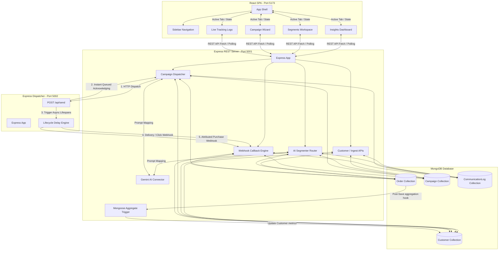

# System Design & Documentation - AI-native Mini CRM

This document details the architectural specifications, database models, system flows, and technical choices implemented in the **AI-native Mini CRM** platform.

---

## 1. Architectural Model

The application leverages a MERN stack (MongoDB, Express, React, Node.js) combined with a decoupled external Channel Service simulation.



### Decoupled Sub-systems
1. **CRM Backend**: Serves as the central API hub. It maintains databases, updates metrics, communicates with Gemini, and schedules outbound message orders.
2. **Channel Service**: Acts as an external, mock communication platform (mimicking Twilio, SendGrid, or WhatsApp Business APIs). It processes dispatches asynchronously to avoid holding CRM HTTP requests open, feeding status webhooks back sequentially.
3. **Vite Frontend Client**: React single-page app displaying real-time campaign performance charts and logs via active polling.

---

## 2. Database Schema Modeling

Database collections are designed with relational links and optimized aggregation triggers.

### A. Customer Collection (`Customer`)
Stores shopper profiles, contact metrics, and dynamic purchase summaries.
```javascript
{
  _id: ObjectId,
  name: String,
  email: String, (unique, indexed)
  phone: String,
  city: String, (indexed for geographic segmenting)
  totalSpend: Number, (default 0, updated via Mongoose Hook)
  orderCount: Number, (default 0, updated via Mongoose Hook)
  lastPurchaseDate: Date, (default null, updated via Mongoose Hook)
  createdAt: Date
}
```

### B. Order Collection (`Order`)
Records individual transaction items linked to a customer.
```javascript
{
  _id: ObjectId,
  customerId: ObjectId, (ref: 'Customer', index: true)
  amount: Number,
  items: [String],
  orderDate: Date
}
```
> [vanilla-note]
> **Data Consistency Trigger (Mongoose Aggregate Hook)**:
> Whenever an `Order` document is saved, a post-save middleware aggregater triggers. It queries all orders associated with the customer, calculates the sum (`totalSpend`), count (`orderCount`), and latest date (`lastPurchaseDate`), and updates the parent `Customer` record atomically. This keeps database lookup performance high for queries.

### C. Campaign Collection (`Campaign`)
Tracks setup, channels, templates, and dynamic performance stats.
```javascript
{
  _id: ObjectId,
  name: String,
  segmentName: String,
  segmentFilter: Mixed, (JSON query filter used to query matching customers)
  channel: String, (enum: 'email', 'whatsapp', 'sms', 'rcs')
  messageTemplate: String,
  status: String, (enum: 'draft', 'sending', 'completed')
  stats: {
    sent: Number,
    delivered: Number,
    failed: Number,
    opened: Number,
    clicked: Number,
    converted: Number,
    revenue: Number
  },
  createdAt: Date
}
```

### D. CommunicationLog Collection (`CommunicationLog`)
Tracks individual message states within a campaign dispatch.
```javascript
{
  _id: ObjectId,
  campaignId: ObjectId, (ref: 'Campaign', index: true)
  customerId: ObjectId, (ref: 'Customer', index: true)
  customerName: String,
  customerEmail: String,
  customerPhone: String,
  channel: String,
  message: String,
  status: String, (enum: 'sent', 'delivered', 'failed', 'opened', 'clicked', 'converted', index: true)
  createdAt: Date,
  updatedAt: Date
}
```

---

## 3. Webhook Delivery & Simulation Life-Cycle

To model communication tracking accurately, message progression maps through a state-machine lifecycle simulated by the Channel Service using asynchronous timeouts.

### Progression Timelines
```
[CRM Dispatch] 
       │ (1. POST /api/send)
       ▼
[Channel Service] ──(Queued Acknowledged)──> [CRM Returns 200 OK]
       │
       ├─► (Delay 1.5s) ──► 95% Delivered / 5% Failed  ──► Callback: /receipt
       │
       └─► (Delay 2.5s) ──► (If Delivered) 60% Opened  ──► Callback: /receipt
             │
             └─► (Delay 2.5s) ──► 30% Clicked          ──► Callback: /receipt
                   │
                   └─► (Delay 3.5s) ──► 20% Converted ──► Callback: /order
```

- **Safety Checks in Callbacks**: Webhook callbacks use a priority ranking checks model (`sent` [1] -> `delivered` [2] -> `opened` [3] -> `clicked` [4] -> `converted` [5]). This ensures that network packet race conditions do not rewrite states out-of-order or double-count metrics in the CRM database.
- **Attributed Revenue Attribution**: If a conversion trigger occurs, the Channel Service posts to `/api/callback/order` containing the `campaignId`. The CRM logs the order (which triggers Customer spend recalculations) and increments the campaign conversion metrics and revenue total.

---

## 4. AI-Native Implementations

We weave AI into two core marketing flows: segmentation and copywriting.

### A. AI Audience Segmentation
Rather than building complex, nested logic forms, marketers describe their target audience in natural language.
- **Model**: Google Gemini API (`gemini-1.5-flash`).
- **Prompt Architecture**:
  - The API passes the request alongside a schema declaration of the `Customer` collection, today's datetime, and relative date calculation anchors (e.g. calculating dates 30 days ago).
  - Gemini outputs a clean MongoDB filter query string.
  - Example input: *"Pune shoppers who spent over 4000 but haven't ordered in 60 days"*
  - Gemini output:
    ```json
    {
      "city": "Pune",
      "totalSpend": { "$gt": 4000 },
      "lastPurchaseDate": { "$lt": "2026-04-15T22:21:00.000Z" }
    }
    ```
  - **Graceful Fallback**: If the Gemini API key is missing or encounters errors, a local RegExp-based keyword parser maps basic properties (cities, spends, counts) so the builder doesn't break.

### B. AI Copywriting Wizard
Generates message suggestions tailored to the marketing channel constraints.
- **Constraints mapped**:
  - *SMS*: Max 160 chars, concise call-to-action.
  - *WhatsApp*: Friendly tone, includes emojis and bullet pointers.
  - *RCS*: Structured details.
  - *Email*: Professional body copy containing a Subject line.
- Custom template tags (e.g., `{{name}}`, `{{city}}`) are suggested and replaced dynamically during dispatch.

---

## 5. UI Theme & Design Decisions

The frontend is styled in modern Vanilla CSS for smooth transitions.

- **Theme Engine**: Double-theme setup.
  - **Dark Mode (Default)**: Deep charcoal, glassmorphism overlays, and border glows.
  - **Light Mode**: Sleek white-slate, high contrast headings, and soft gray cards.
  - **Theme Controller**: The sidebar houses a toggle switch which modifies React state and binds the `.theme-light` class to the HTML body, triggering fluid color fades.
- **Charts Visualization**: Implements Recharts (Area, Bar, and Donut charts) split across sub-tabs:
  - *Performance Tab*: Outbound funnel mapping and channel revenue distribution.
  - *Shopper Analytics Tab*: Geographic spending breakdown and customer retention stats.
